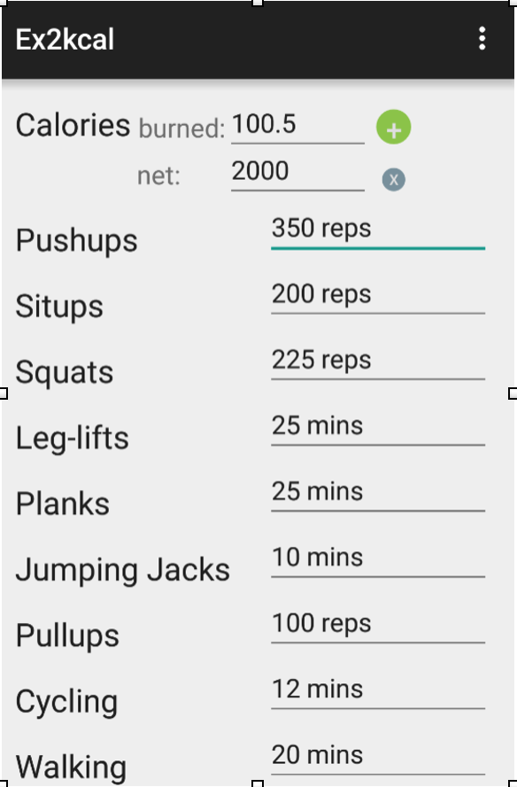
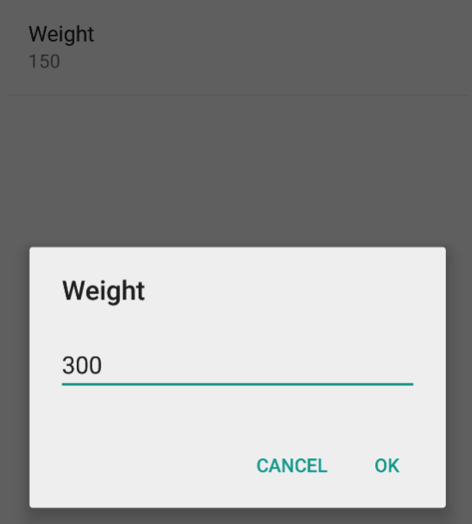
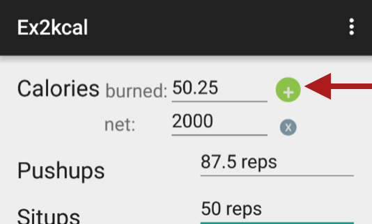
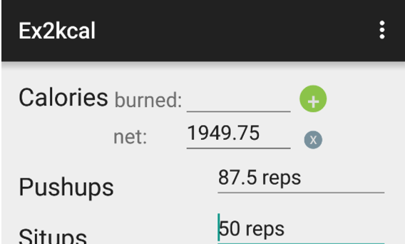

# PROG 01: Crunch Time

Exercise to calories converter
* Over 11 exercises!
* Convert from target calories to exercise and back!
* All data on the screen at once! Hardly any tapping needed!
* Factors in user weight
* Helps you calorie count with "net calories" tracker

## Authors

Colbert Guan ([colbyguan@berkeley.edu](mailto:colbyguan@berkeley.edu))

## Demo Video

See [Ex2kcal walkthrough] (https://youtu.be/rIoyxfkLU2Y)

## Screenshots

## Acknowledgments

* Tab completion
* Numerous stackoverflow answers for dealing with hard/soft keyboard input
